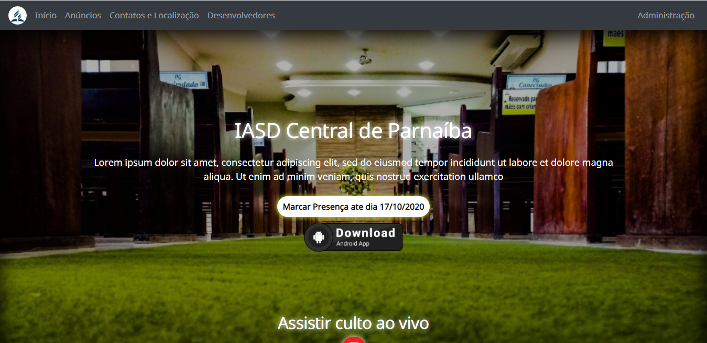
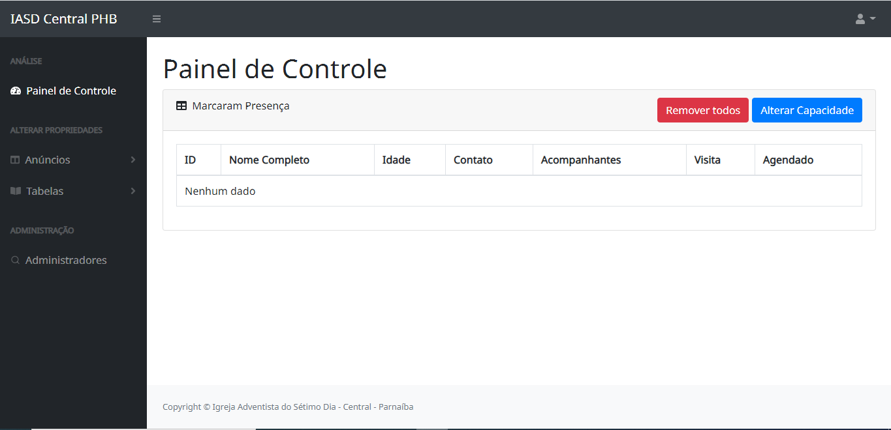
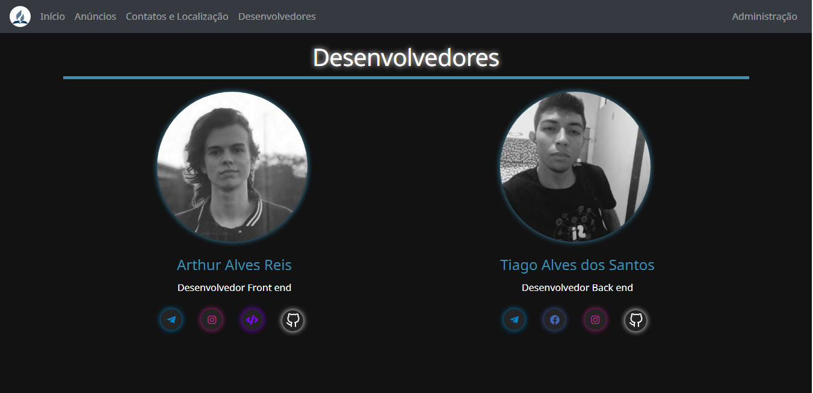
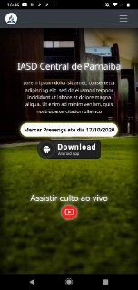
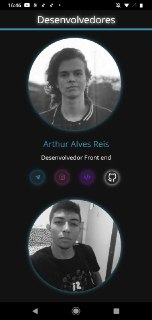

<h1 style='text-align:center;'>Projeto Iasdsys</h1>

## Sobre o sistema Iasdsys

 Nesse espaço colocaremos uma descrição, quando tivermos mais tempo! link de acesso: <a href="https://iasdcentralphb.com.br/">Iasdsys</a>

### Tecnologias Usadas

 Em resumo para o desenvolvimento deste projeto foi usado o frameork laravel como artesão da web em conjuntos com outras tenologias como o BootStrap 4, Jquery, Blade entre outras!</a>

## Imagens do projeto

#### Desktop(WEB)
<table>
   <tr>
       <td>Tela Inicial</td>
       <td>Painel de Controle</td>
       <td>Tela Desenvolvedores</td>
   </tr>
    <tr>
        <td style="width:400px"></td>
        <td style="width:400px"></td>
        <td style="width:400px"></td>
   </tr>
</table>

#### Aplicação Celular(Mobile) 
<table>
   <tr>
       <td>Tela Inicial</td>
       <td>Painel de Controle</td>
       <td>Tela Desenvolvedores</td>
   </tr>
    <tr>
       <td style="width:400px"></td>
       <td style="width:400px"></td>
        <td style="width:400px"></td>
   </tr>
</table>

## Contribuidor do projeto

<h4><a href="https://github.com/Tiago-Alves-dos-Santos">Tiago Alves / Back-End</a></h3>
